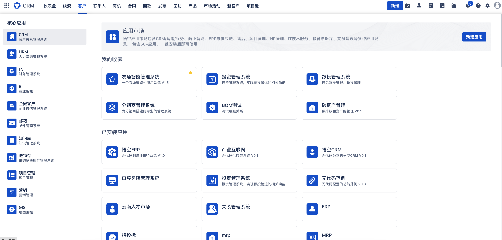
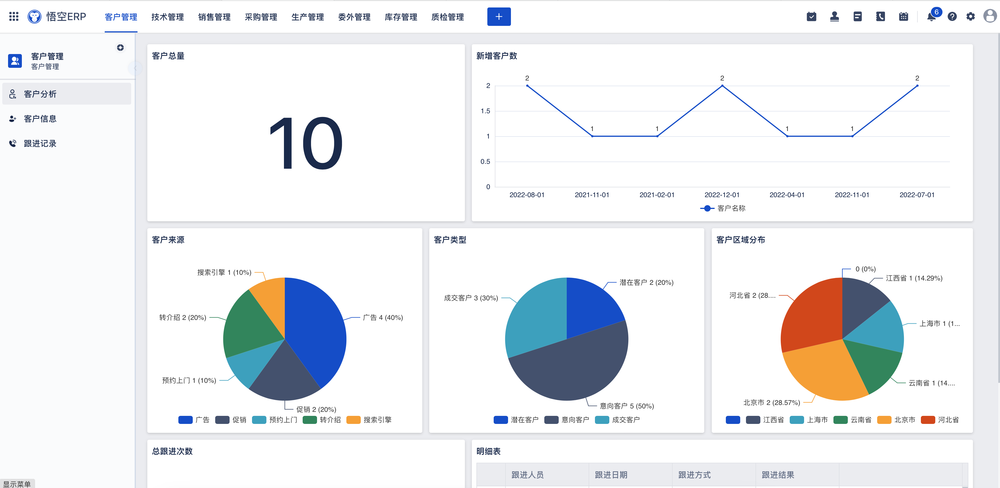
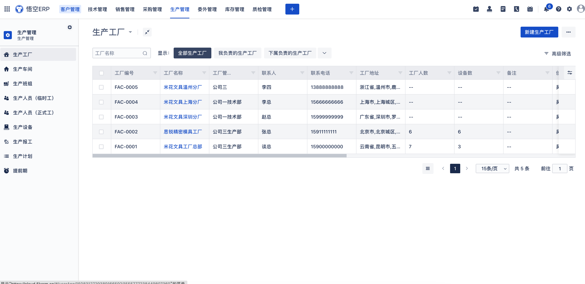

# 悟空无代码平台


体验地址：[https://www.72crm.com](http://www.72crm.com)

## 悟空无代码平台介绍


悟空无代码平台正式开源，通过悟空无代码平台开发工具，企业可自主地快速开发出适合企业需要的信息化系统，开发过程只需要业务人员参与，开发效率极高，维护性很强。

开发人员可以通过无码的形式，在可视化设计器中，用鼠标拖拽和点选的开发方式，快速搭建企业应用软件。开发人员利用开发平台，可以跳过基础架构，直接进入与业务需求相关的工作。

悟空无代码平台与传统的通过代码的开发方式相比，这种面向业务的开发方式，开发迅速，调整极快，能够快速适应企业需求，也能够快速应对企业变化。


官网地址：[http://www.5kcrm.com](http://www.5kcrm.com/)


QQ群交流群群：[259359511](https://qm.qq.com/cgi-bin/qm/qr?k=G9T2audQqbZBR_HG0aTP9E-8fE7oMeb8&jump_from=webapi)


扫码添加小悟官方客服微信，邀您加入千人微信交流群：


关注悟空CRM公众号，了解更多悟空资讯


 :boom:  :boom:  :boom: 注：悟空无代码平台采用全新的前后端分离模式，本仓库代码中已集成前端vue打包后文件，  **可免去打包操作，无需运行前端** 


## 悟空CRM目录结构

``` lua
wk_modules
├── module        -- 无代码模块
├── gateway       -- 网关模块
```

### 核心功能模块

 **字段组件丰富：** 多行文本、网址、数字、下拉列表、星级、百分比、时间、多选等丰富控件，满足多场景表单需求<br/>
 **布局样式多样：** 可调整表单内容大小与形式、平铺或下拉等格式，满足表单元素多样化，充分应用布局创新性与用户主观能动性。<br/>
 **跨应用关联：** 不同应用之间数据关联以实现跨应用数据调取，同时支持对不同应用数据间的筛选与聚合，做一进满足所需。<br/>
 **多维权限设置：** 对于表单内容，可对其权限设为必填、设为唯一或选择隐藏，进一步满足多场景需求。<br/>
 **节点类型多样：** 审批节点、填写节点、抄送节点等，根据节点任务选择对应类型，满足多样场景下的流程需求。<br/>
 **分支规则设定：** 流程中创建分支后，只有符合数据筛选标准的数据才能进入对应的分支，实现对数据的筛选与分流。<br/>
 **节点权限控制：** 不同应用之间数据关联以实现跨应用数据调取，同时支持对不同应用数据间的筛选与聚合，做一进满足所需。<br/>
 **操作简单灵活：** 一拖一拽、迅速搭建；上下左右、随意布局。通过拖拽方式，将各类组件进行添加；同时支持放大缩小，全方位控制布局<br/>
 **支持多元组件：** 丰富多样的组件库，按需整合信息。筛选/文本/报表等多种组件；按需配置、进行信息整合，打造多样业务枢纽<br/><br/>
 **多类型图标样式：** 数据表、汇总表、指标卡等数十种图标类型，涵盖广泛的应用场景，全面展示系统数据、科学反映数据信息。<br/>
 **多维度分析：** 深入分析多个因素的综合影响，将用户特征、业务场景和用户行为等将信息标签化，使分析结果更科学完整。<br/>


## 悟空无代码平台使用的主要技术栈

|名称                 | 版本                     | 说明   |
|---------------------|---------------------------|----  |
| spring-cloud-alibaba| 2021.0.4                  |  核心框架  |
| spring-boot         | 2.6.11                    |  spring版本  |
| mybatis-plus        | 3.5.2                     |  ORM框架  |
| nacos               | 2.1.0                     |  注册中心以及配置管理  |
| seata               | 1.2.0                     |  分布式事务 |
| elasticsearch       | 6.8.6                     |  搜索引擎中间件  |
| jetcache            | 2.7.1                     |  分布式缓存框架  |
| feign               | 3.1.4                     |  服务调用        |


## 使用说明

### 一、前置环境
- Jdk1.8^
- Maven3.5.0^   
- Mysql5.7^ （<a href="https://gitee.com/wukongcrm/crm_pro/wikis/mysql配置说明" target="_blank">数据库安装注意事项</a>）
- Redis(版本不限)
- Elasticsearch 6.8.6 （<a href="https://gitee.com/wukongcrm/crm_pro/wikis/elasticsearch配置说明" target="_blank">环境配置注意事项</a>）
- Nacos（1.4^)

### 安装


### 手动安装说明
     
#### 1. 导入初始化sql,目前项目下gateway模块使用的独立数据库，其他模块使用同一数据库
      

- 安装nacos，新建数据库 `nacos` 在`nacos`数据库中运行` DB/nacos.sql`<br/>
  修改nacos安装目录/conf/application.properties文件，修改数据持久化类型为mysql，添加mysql数据源的url、用户名和密码,配置如下。<br/>
   
```
   spring.datasource.platform=mysql
   db.num=1
   db.url.0=jdbc:mysql://127.0.0.1:3306/nacos?characterEncoding=utf8&connectTimeout=1000&socketTimeout=3000&autoReconnect=true
   db.user=root
   db.password=password
```

- 修改gateway模块数据库配置为`nacos`数据库
- 初始化其余模块数据库：新建数据库 `wk_crm_single` 在`wk_crm_single`数据库中运行 `DB/wk_crm_single.sql`
- 初始化定时任务模块数据库：新建数据库 `xxl_job` 在`xxl_job`数据库中运行 `DB/xxl_job.sql`
- 初始化seata数据库：新建数据库 `seata` 在`seata`数据库中运行 `DB/seata.sql`


#### 2.在项目根目录执行`mvn install`


#### 3.在各个模块下resource目录配置数据库帐号信息以及redis帐号信息`（默认使用的是application-dev.yml配置文件,打包后启动脚本默认使用的application-test.yml配置文件）`


#### 4.在`crm\src\main\resources\application-dev.yml`里面修改elasticsearch配置

        
```
spring.elasticsearch.rest.uris = elasticsearch地址 例：127.0.0.1:9200
spring.elasticsearch.rest.username = elasticsearch用户名 例：elastic 无密码可留空
spring.elasticsearch.rest.password = elasticsearch密码 例: password 无密码可留空

```

注意：elasticsearch [配置注意点](https://gitee.com/wukongcrm/crm_pro/wikis/elasticsearch配置说明?sort_id=2927431)

#### 5.（可选）修改系统中文件上传地址，默认为本地配置，本地上传还需配置公网地址，指向服务器网关

```
crm.upload.config:1                文件上传配置 1:本地 2:阿里云OSS 
crm.upload.oss                     oss上传文件所需配置内容 
crm.upload.oss.bucketName        需要配置两个bucket，0为登录才可访问文件上传地址，1为完全公开文件上传地址
crm.upload.local                   本地上传文件所需配置内容 
crm.upload.local.uploadPath      需要配置两个地址0为登录才可访问文件上传地址，1为完全公开文件上传地址
```

#### 6.（可选）修改jetcache缓存配置详见 <a href="https://github.com/alibaba/jetcache/wiki" target="_blank">官方文档</a> 


#### 7.（可选）项目日志文件在`core\src\main\resources\logback-spring.xml`修改
            

#### 8. 项目打包部署


```
·在项目根目录下执行 mvn clean -Dmaven.test.skip=true package
·然后把对应模块下target文件夹下
·${name}-${version}-SNAPSHOT.zip/tar.gz上传到服务器,例：admin-0.0.1-SNAPSHOT.zip 并将压缩文件解压，检查对应配置文件。

```


#### 9. 项目启动 <br/>


```
先启动nacos,seata,sentinel, elasticsearch,mysql,redis等基础服务
在第八步解压的文件模块下通过执行`sh 72crm.sh start`（windows下直接运行72crm.bat）启动各个模块服务。
其中项目基础模块：gateway，authorization，admin必须启动，其他模块可按需启动。
启动完成后，在浏览器中访问：http://localhost:8443/即可登录系统

```
#### 10. 初始化用户信息(序列号)<br/>


```
访问http://localhost:8443/  
按照提示初始化超级管理员账号和密码信息,其中序列号填写，成功之后使用初始化后的管理员账户登录系统添加其他员工，分配权限等
激活序列号：
6EA74C261C4BA344BC716FCD68295694BABFE016F5B7FA4890E4E29B0F52A5D965EE4A1AF633633D4573A2559630986F976D8F2920D688686CB60967F6FFB9FDADE6AC6DFD39416DE175D0DE01699C816244C16EE4E533A959E3ED0653143A7363E5B98E62126A78CDC5578636F456D29FD2B063FCBED837D50B10450C6FFBF0290DB782C8D4525864A96A98C37C0106FB5D8392A7E828F0BEFA86B4CD28BEBE83628A59BB23F60B7799A22C8D7B2039ED30F05492E9D2A2E2A03D7AC0199EA2CE529D561AE622B3C0DECC50D8A223BC5DA03E3AFF1150F0F217B0BE0400835369329DB74454870D5314DBA7C24B98CCE5600CBDAF264A21974FA3C85E7EAF0A

```

#### 11. 升级说明以及注意事项<br/>

```
1、后端代码更新直接下载全量代码替换即可
2、数据库更新请下载 DB/update/V11.x.x.sql，增量执行即可（比如当前版本为V11.0.1，升级为V11.1.0需执行 V11.0.2.sql,V11.1.0.sql）
3、docker更新请使用在线更新或手动将数据库数据备份后执行增量升级SQL，再备份至本地，然后下载新版docker镜像，将增量升级后SQL恢复至新版数据库

```


### 三、其他说明

#### 1.代码生成器及接口文档<br/>


```
代码生成器地址：core\src\test\com\kakarote\generator\Generator.java
接口文档地址`http://localhost:8443/doc.html`
```


#### 2.模块依赖关系 <br/>

```
- 除网关外，其余项目均依赖于admin模块，用于获取当前登录人的信息
- oa模块的任务依赖于work模块，其余一些关联业务功能依赖于crm模块，examine模块
- 商业智能依赖crm,oa模块

```

### 四、悟空无代码平台功能模块预览




